<div align="center">
  <h1 style="text-align: center;font-weight: bold">Laporan Praktikum
  <br>Workshop Administrasi Jaringan</h1>
  <h4 style="text-align: center;">Dosen Pengampu : Dr. Ferry Astika Saputra, S.T., M.Sc.</h4>
</div>
<br />
<div align="center">
  
  <h3 style="text-align: center;">Disusun Oleh : </h3>
  <p style="text-align: center;">
    <strong>Ragil Ridho Saputra</strong><br>
    <strong>3123500016 </strong><br>
    <strong>D3 IT A</strong>
  </p>
<h3 style="text-align: center;line-height: 1.5">Politeknik Elektronika Negeri Surabaya<br>Departemen Teknik Informatika Dan Komputer<br>Program Studi Teknik Informatika<br>2024/2025</h3>
  <hr><hr>
</div>

# 2 VM yang digunakan

Dalam praktikum ini, Virtual Machine yang digunakan adalah debian dengan GUI dan debian yang tidak memiliki GUI. Praktikum ini bertujuan untuk mengkoneksikan 2 VM agar bisa terhubung. VM1 adalah VM tanpa GUI dan VM2 adalah VM dengan GUI, fokus utama dalam praktikum ini adalah konfigurasi pada VM1 yang menggunakan bridge network, sedangkan VM2 menggunakan Internal network dan mengkonfigurasi samba.

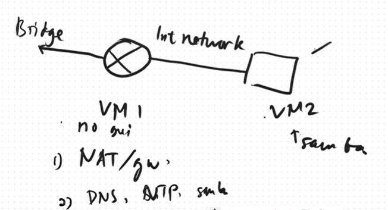

# Konfigurasi Koneksi VM1 dan VM2

## Network Interface

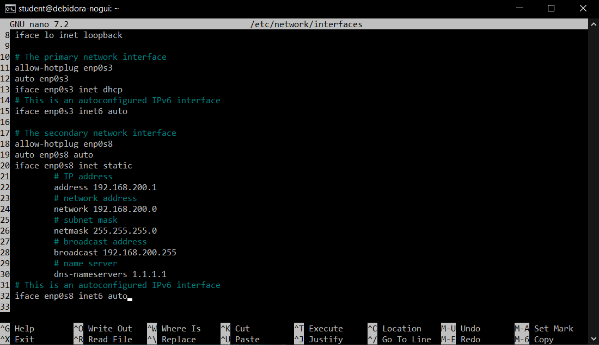

Konfigurasi pada gambar adalah mengatur loopback interface (lo) untuk komunikasi internal dengan alamat 127.0.0.1, serta dua interface fisik; 

- interface pertama (enp0s3) dikonfigurasi menggunakan `allow-hotplug` untuk mengaktifkan interface secara otomatis saat perangkat terdeteksi dan diatur untuk memperoleh alamat IPv4 secara dinamis melalui DHCP, dengan pengaturan IPv6 yang menggunakan autoconfiguration.
- interface kedua (enp0s8) diatur dengan kombinasi `allow-hotplug` dan `auto` untuk memastikan interface aktif saat booting, serta dikonfigurasi secara statis dengan alamat IP 192.168.200.1, netmask 255.255.255.0, broadcast 192.168.200.255, dan disertai pengaturan jaringan melalui baris `network 192.168.200.0`, serta menggunakan Cloudflare DNS (1.1.1.1) untuk penetapan `dns-nameservers`, sedangkan IPv6 pada interface ini juga diatur dengan autoconfiguration.
- Alamat 127.0.0.1 adalah alamat loopback standar yang digunakan pada sistem operasi berbasis Unix/Linux untuk komunikasi internal. Meskipun di dalam file konfigurasi tidak tertulis secara eksplisit angka “127.0.0.1”, baris konfigurasi `iface lo inet loopback` secara implisit menunjukkan bahwa interface lo (loopback) menggunakan alamat tersebut, karena itulah yang telah distandarisasi dan secara default diharapkan pada sistem tersebut.

---

## IPv4 Forwarding

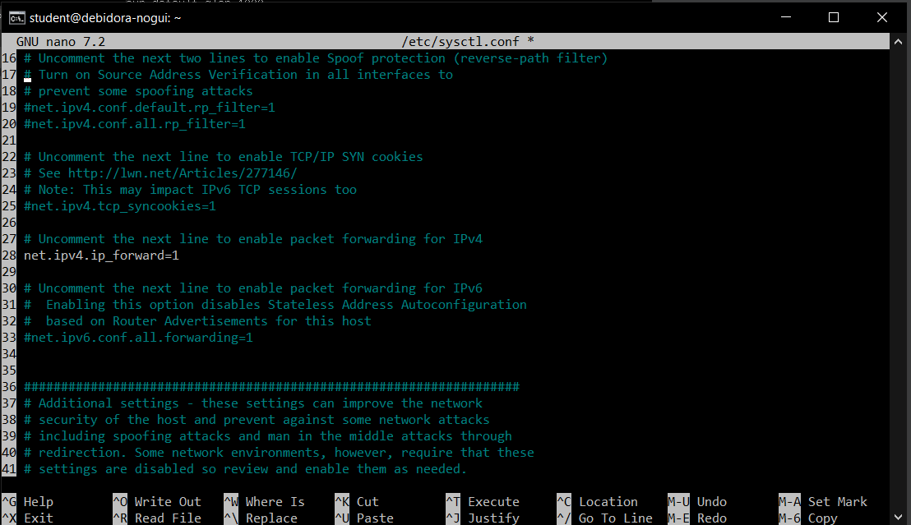

Baris `net.ipv4.ip_forward=1` digunakan untuk mengaktifkan kemampuan sistem Linux dalam meneruskan (forward) paket data IPv4 antar interface jaringan, yang memungkinkan komputer tersebut berperan sebagai router atau gateway untuk menghubungkan dan mengalirkan trafik antar jaringan yang berbeda, serta merupakan komponen penting dalam implementasi NAT, VPN, atau solusi jaringan lainnya.

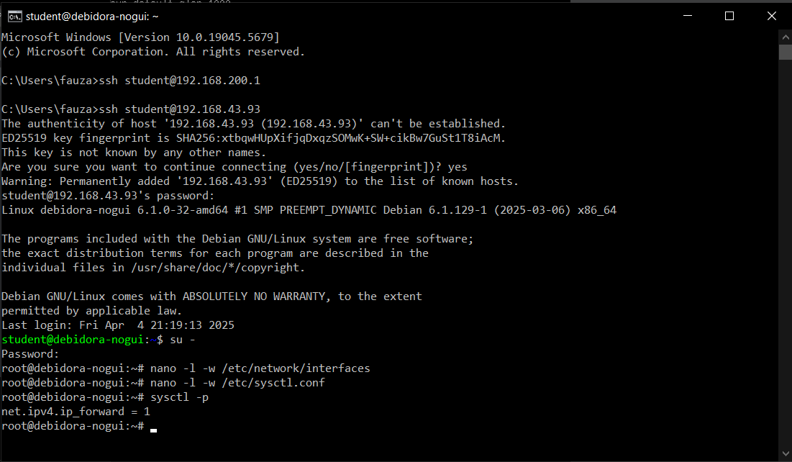

Dapat dilihat system control-nya ada perubahan konfigurasi di IP Forwardnya yaitu menjadi 1. Perintah IP forward ini yang akan menginformasikan bahwa 2 interface (enp0s8 dan enp0s3) bisa saling meng-forward-kan paket.

---

## NAT

### **Instalasi iptables dan iptables-persisten**t

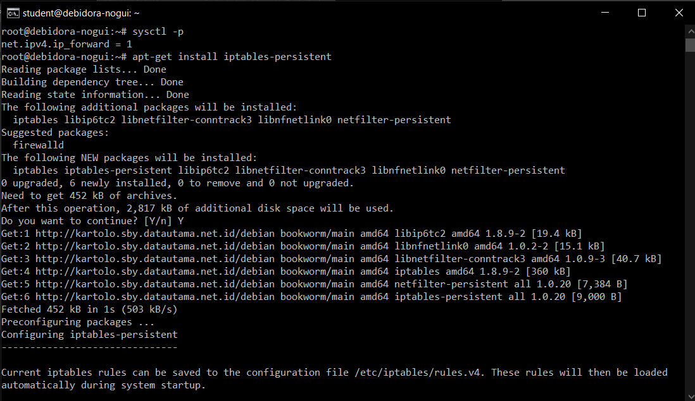

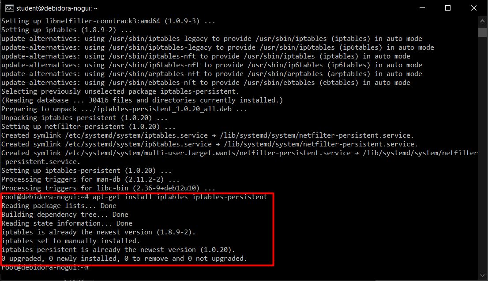

### **Membuat iptables rules**

Membuat iptables rules pada file `rules.v4` 

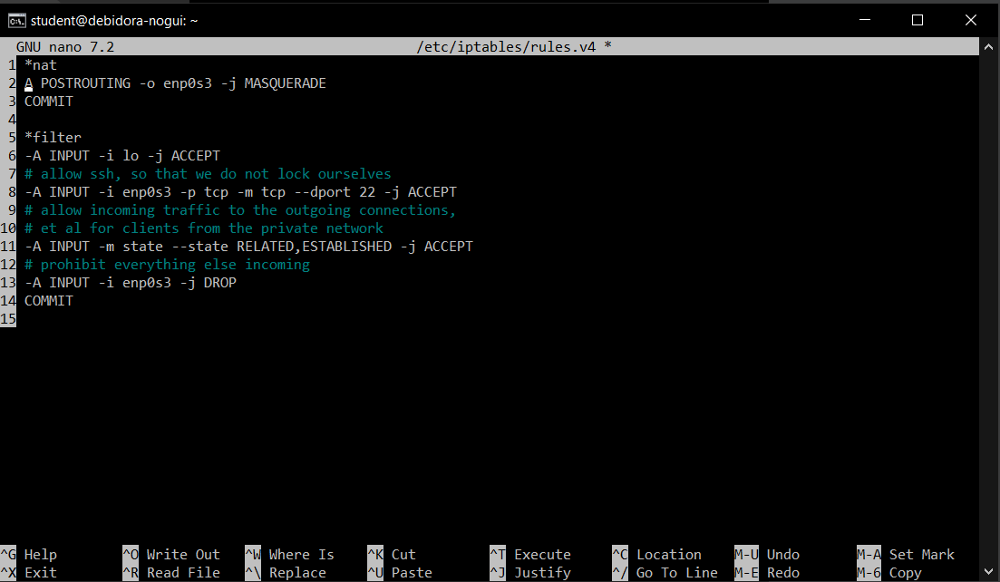

Pada potongan konfigurasi `/etc/iptables/rules.v4` dalam gambar tersebut, terdapat dua tabel utama yang diatur, yakni tabel **nat** dan tabel **filter**. 

- Pada tabel **nat**, ada satu aturan (rule) `-A POSTROUTING -o enp0s3 -j MASQUERADE` yang berfungsi melakukan NAT tipe masquerade pada interface `enp0s3`;
    - ini umumnya digunakan ketika suatu sistem berperan sebagai gateway/router bagi jaringan lokalnya, sehingga lalu lintas yang keluar ke internet akan menggunakan IP address interface `enp0s3`.
    - **Masquerade** berfungsi untuk menyembunyikan alamat IP asli dari perangkat-perangkat di jaringan internal dengan menggantikannya menggunakan alamat IP dari interface publik (dalam hal ini `enp0s3`). Dengan demikian, ketika perangkat internal mengakses internet, koneksi tersebut seolah-olah berasal dari alamat IP publik server, sehingga memudahkan pengaturan routing balik (return routing) dan keamanan, terutama jika alamat IP publik yang digunakan bersifat dinamis.
- Sementara itu, di tabel **filter**, dapat dijumpai beberapa aturan yang mengatur lalu lintas masuk (INPUT) antara lain:
    - (1) memperbolehkan semua paket yang berasal dari diri sendiri (loopback) dengan `-A INPUT -i lo -j ACCEPT`
    - (2) mengizinkan koneksi SSH pada port 22 melalui aturan `-A INPUT -p tcp --dport 22 -j ACCEPT` agar server tetap dapat diakses secara remote
    - (3) mengizinkan koneksi terkait atau sudah terjalin dengan `-A INPUT -m state --state RELATED,ESTABLISHED -j ACCEPT`
    - (4) mengizinkan lalu lintas dari interface tertentu (misalnya `-A INPUT -i enp0s8 -j ACCEPT`) yang dianggap sebagai jaringan internal.
    - (5) menutup (DROP) lalu lintas masuk dari interface luar (enp0s3) atau segala lalu lintas yang tidak memenuhi kriteria aturan sebelumnya, guna meningkatkan keamanan server.

Dengan demikian, konfigurasi ini secara garis besar menerapkan NAT (masquerade) pada interface WAN `enp0s3`, sambil memperketat akses masuk melalui firewall dengan tetap mengizinkan koneksi penting seperti loopback, SSH, dan koneksi internal/terkait.

### **Setting VM2 Network Manager**

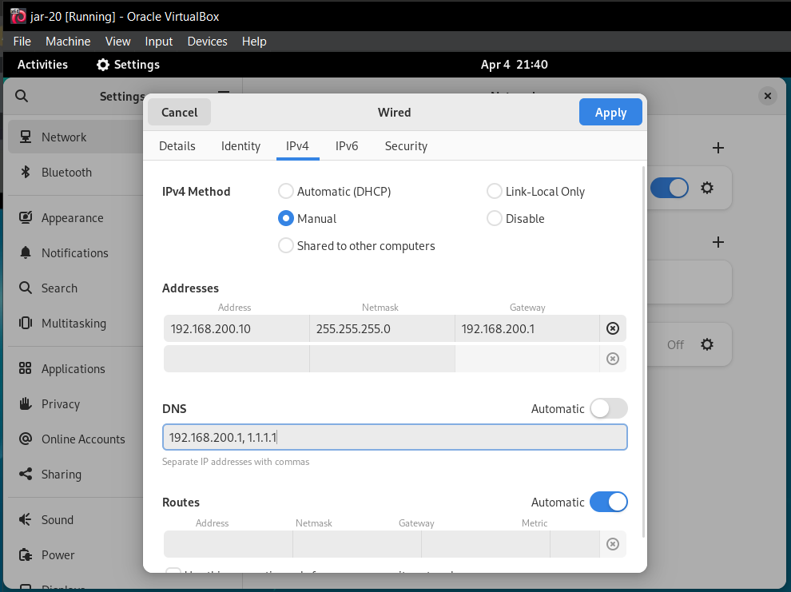

Setelah konfigurasi, maka VM1 dan VM2 sudah terhubung dalam satu network.

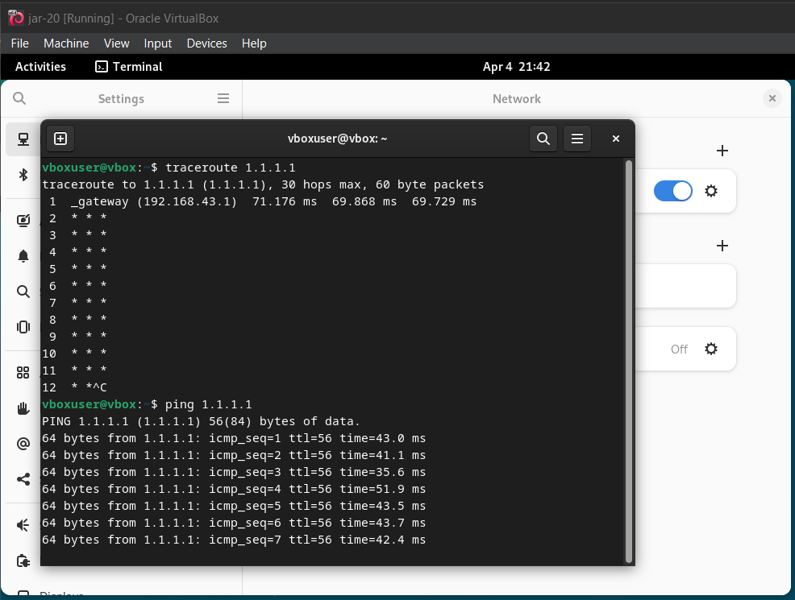

Terlihat bahwa ping sudah berhasil dan terkoneksi.

---

# Konfigurasi NTP VM1

Langkah pertama untuk konfigurasi NTP adalah melakukan instalasi NTP pada VM1.

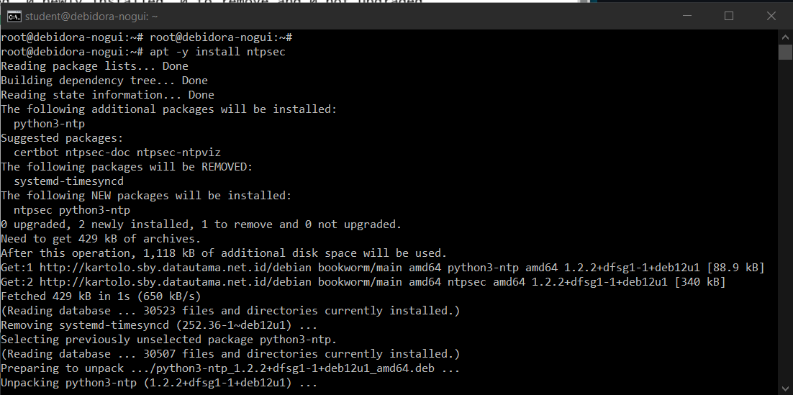

Menambahkan NTP Server sesuai dengan timezone, untuk praktikum ini maka timezone yang digunakan adalah indonesia yaitu *id*

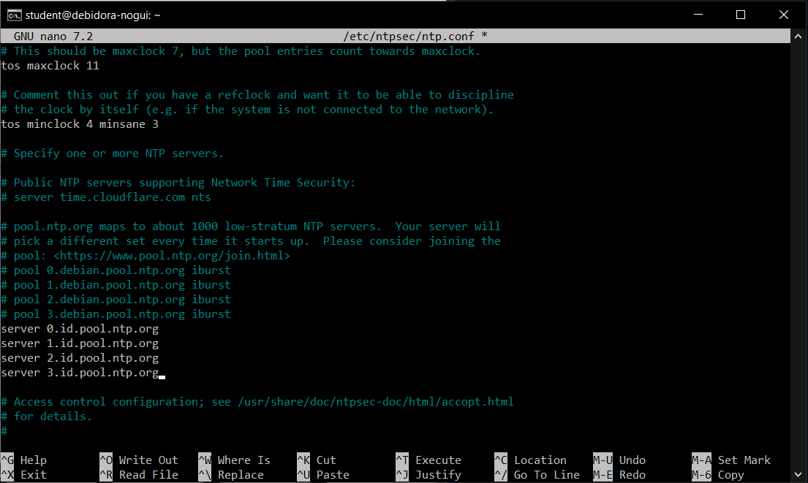

Restart NTP dan lakukan percobaan dengan command `ntpq -p`

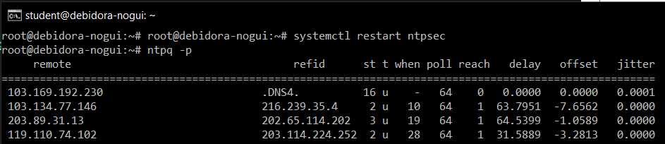

---

# Konfigurasi Samba VM1

**Langkah pertama untuk konfigurasi NTP adalah melakukan instalasi Samba pada VM1.**

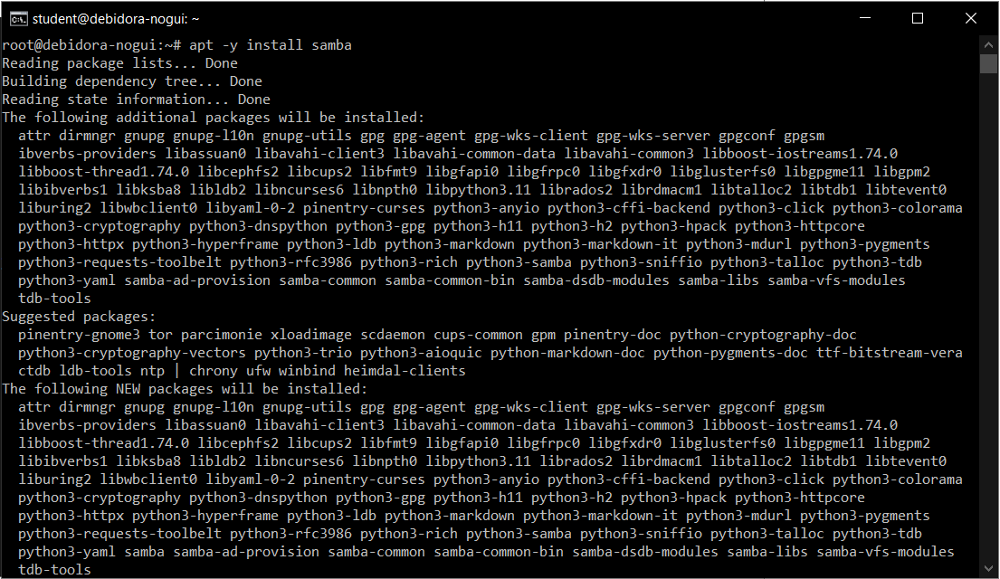

Konfigurasi Samba yang akan digunakan disini adalah fully share folder. 

**Langkah kedua yang dilakukan adalah membuat shared folder dengan command berikut**

```bash
root@smb:~# mkdir /home/share
root@smb:~# chmod 777 /home/share
```

**Lalu lakukan konfigurasi pada /etc/samba/smb.conf**

Tambahkan unix charset = UTF-8 dan interfaces 127.0.0.0/8 10.0.0.0/24 192.0.0.0/24

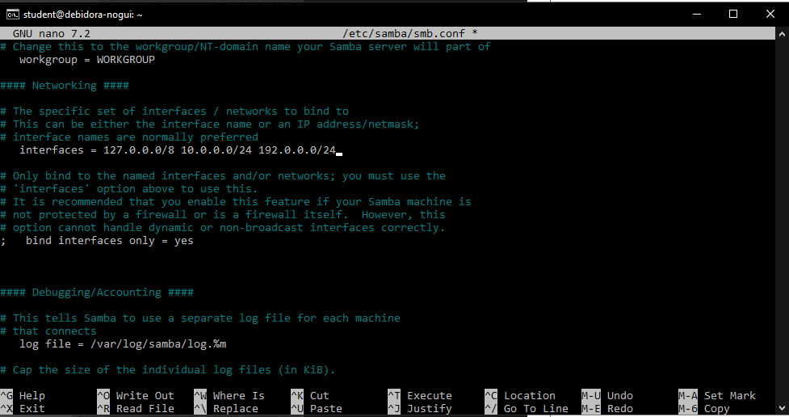

Cek map to guest = bad user

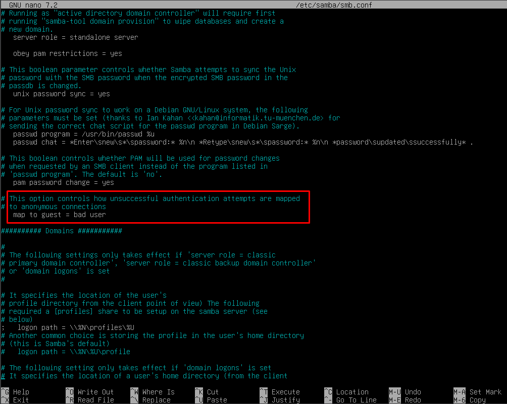

Konfigurasi shared directory

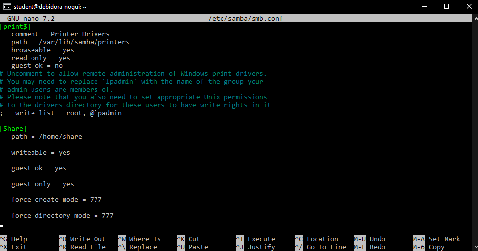

Save lalu lakukan restart smbd

Restart smbd menggunakan command `systemctl restart smbd`


**Cek dan test apakah bisa diakses pada VM2 menggunakan internal network**


---

# Konfigurasi DNS VM1

## Konfigurasi Jaringan Internal

### Instalasi BIND

Masuk root, dan gunakan command dibawah ini untuk menginstall bind9

```bash
root@dlp:~# apt -y install bind9 bind9-utils
```

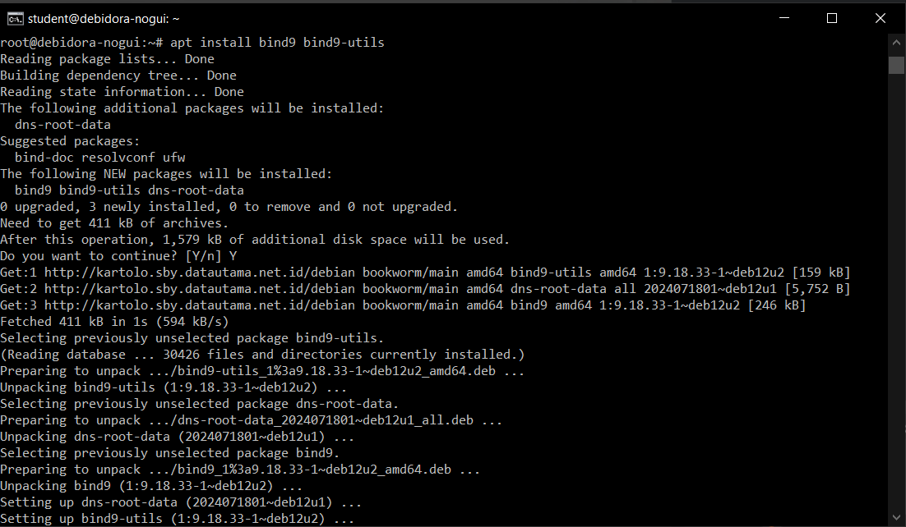

### Konfigurasi dan Penyesuaian BIND

Menambahkan file konfigurasi baru yaitu `named.conf.internal-zones` ke dalam file utama konfigurasi BIND `/etc/bind/named.conf`

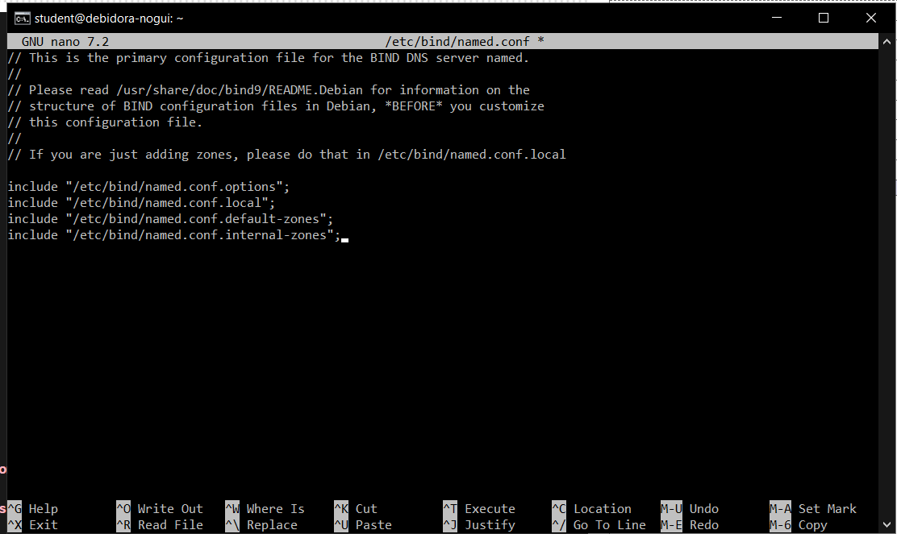

### Konfigurasi ACL entry untuk local network

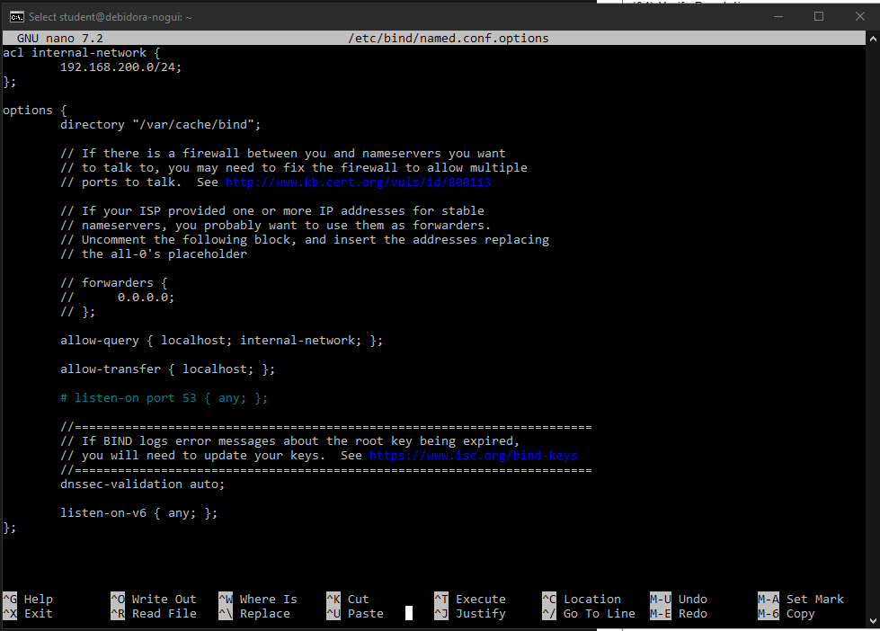

- **Menentukan ACL (Access Control List)**
    - Anda membuat ACL bernama `internal-network` untuk jaringan **192.168.200.0/24**.
    - ACL ini digunakan untuk menentukan siapa saja yang diizinkan mengakses layanan DNS.
- **Mengatur kebijakan query dan transfer zona**
    - `allow-query { localhost; internal-network; };` → Hanya mengizinkan **localhost** dan jaringan **internal** untuk melakukan query ke DNS server.
    - `allow-transfer { localhost; };` → Hanya mengizinkan **localhost** untuk melakukan transfer zona, biasanya untuk secondary DNS.
- **Mengatur validasi DNSSEC dan konfigurasi IPv6**
    - `dnssec-validation auto;` → Mengaktifkan validasi DNSSEC secara otomatis.
    - `listen-on-v6 { any; };` → Konfigurasi agar BIND mendengarkan koneksi IPv6.

### Konfigurasi Zona DNS di BIND

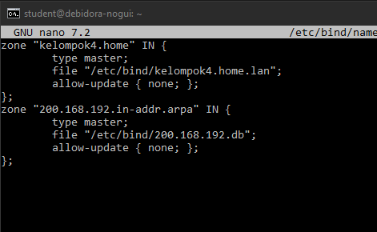

- **Zona Forward (kelompok4.home)**
    - Zona ini digunakan untuk menerjemahkan **nama domain ke alamat IP**.
    - Disimpan dalam file **`/etc/bind/kelompok4.home.lan`**.
    - Bertindak sebagai **master** (utama), artinya server ini adalah sumber resmi data DNS untuk domain tersebut.
    - `allow-update { none; };` → Tidak mengizinkan update dinamis ke zona ini.
- **Zona Reverse (200.168.192.in-addr.arpa)**
    - Zona ini digunakan untuk **menerjemahkan alamat IP ke nama domain** (reverse lookup).
    - Disimpan dalam file **`/etc/bind/200.168.192.db`**.
    - Juga bertindak sebagai **master**, dengan **update dinamis dinonaktifkan**.

### Konfigurasi BIND agar hanya menggunakan IPv4

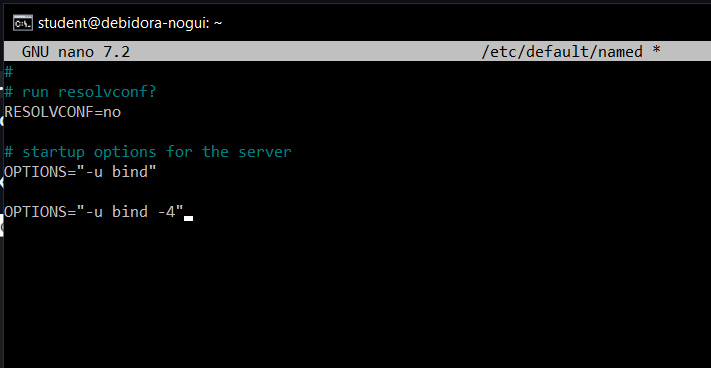

**Mengedit file `/etc/default/named`**

- Menambahkan opsi `OPTIONS="-u bind -4"`, yang menginstruksikan BIND untuk hanya menggunakan **IPv4** dan mengabaikan **IPv6**.
- Ini berguna jika jaringan Anda hanya menggunakan IPv4 dan ingin menghindari log error terkait IPv6.

## Konfigurasi Zone Files

### **Pembuatan dan konfigurasi file zona forward lookup pada BIND DNS Server.**

Buat file zona yang memungkinkan server menerjemahkan nama domain menjadi alamat IP. Konfigurasikan seperti di bawah ini menggunakan Jaringan internal **`192.168.200.0/24`**, Nama domain `kelompok4.home`

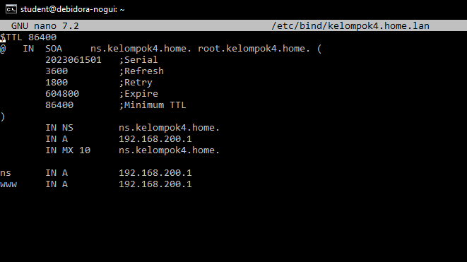

1. **$TTL 86400**

Menentukan nilai default **Time To Live** untuk semua record dalam zona, yaitu 86400 detik (24 jam). Ini artinya informasi DNS akan disimpan (cache) selama 24 jam oleh resolver sebelum dicek ulang.

2. **SOA (Start of Authority) Record**

```
@   IN  SOA ns.kelompok4.home. root.kelompok4.home. (
        2023061501 ; Serial
        3600       ; Refresh
        1800       ; Retry
        604800     ; Expire
        86400 )    ; Minimum TTL

```

- Menyatakan bahwa `ns.kelompok4.home.` adalah **DNS authoritative server** untuk domain `kelompok4.home`.
- `root.kelompok4.home.` adalah alamat email administrator DNS (ditulis dengan tanda titik sebagai pengganti `@`, jadi ini berarti `root@kelompok4.home`).
- Parameter:
    - **Serial**: Versi konfigurasi. Harus diubah setiap kali zona diubah (biasanya dalam format `YYYYMMDDnn`).
    - **Refresh**: Interval untuk slave DNS agar memeriksa perubahan di master (3600 detik = 1 jam).
    - **Retry**: Waktu tunggu sebelum mencoba ulang jika slave gagal menghubungi master (1800 detik = 30 menit).
    - **Expire**: Waktu maksimal data zona dianggap valid jika slave tidak bisa menghubungi master (7 hari).
    - **Minimum TTL**: TTL minimum untuk semua record jika tidak ditentukan (86400 detik).

3. **NS (Name Server) Record**

```
IN NS ns.kelompok4.home.

```

- Menunjukkan bahwa **`ns.kelompok4.home.`** adalah **Name Server** untuk domain `kelompok4.home`.
- **Gunanya**: Memberi tahu resolver DNS mana yang bertanggung jawab menangani permintaan DNS untuk domain ini.

4. **A (Address) Record**

```
ns IN A 192.168.200.1
www IN A 192.168.200.1

```

- `ns.kelompok4.home.` dan `www.kelompok4.home.` masing-masing dipetakan ke alamat IP **192.168.200.1**.
- A record digunakan untuk menerjemahkan **nama domain** menjadi **alamat IP**.

5. **MX (Mail Exchange) Record**

```
IN MX 10 ns.kelompok4.home.

```

- Menentukan **Mail Server** untuk domain `kelompok4.home` adalah `ns.kelompok4.home.` dengan prioritas **10**.
- MX record digunakan untuk **mengatur pengiriman email**, dan menentukan server mana yang menangani email untuk domain tersebut.

### **Pembuatan dan konfigurasi file zona reverse lookup pada BIND DNS Server.**

Buat file zona yang memungkinkan server menerjemahkan alamat IP menjadi nama domain. Konfigurasikan seperti di bawah ini menggunakan Jaringan internal **`192.168.80.0/24`**, Nama domain `kelompok4.home`

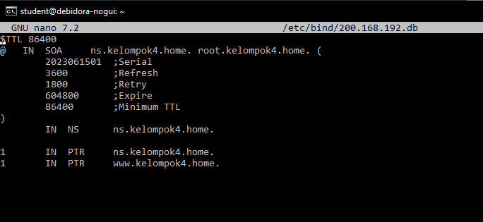

**Lokasi File**

`/etc/bind/200.168.192.db` ini adalah file zona untuk reverse DNS dari `192.168.200.0/24`, biasanya dikaitkan dalam konfigurasi zone dengan:

```bash
zone "200.168.192.in-addr.arpa" {
    type master;
    file "/etc/bind/200.168.192.db";
};
```

**1. `$TTL 86400`**

Seperti sebelumnya, ini menyatakan Time To Live default untuk semua entri DNS, yaitu 86400 detik (24 jam).

**2. SOA Record**

```bash
@ IN SOA ns.kelompok4.home. root.kelompok4.home. (
        2023061501 ;Serial
        3600       ;Refresh
        1800       ;Retry
        604800     ;Expire
        86400 )    ;Minimum TTL
```

- Menandakan awal otoritas zona.
- `ns.kelompok4.home.` adalah DNS server utama.
- `root.kelompok4.home.` adalah email admin (ditulis dengan titik menggantikan `@`).
- Parameter seperti serial, refresh, retry, expire, dan TTL berfungsi sama seperti pada zona forward.

**3. NS Record**

```bash
IN NS ns.kelompok4.home.
```

- Menunjukkan bahwa `ns.kelompok4.home.` adalah authoritative name server untuk zona reverse ini.

**4. PTR Record**

```bash
1 IN PTR ns.kelompok4.home.
1 IN PTR www.kelompok4.home.
```

- Ini adalah **reverse record**.
- `1` berarti **192.168.200.1** karena zona ini adalah `200.168.192.in-addr.arpa`.
- Baris ini menyatakan:
    - **192.168.200.1 → ns.kelompok4.home.**
    - **192.168.200.1 → [www.kelompok4.home](http://www.kelompok4.home/).**

### Testing menggunakan VM2

**Restart BIND pada VM1 untuk menerapkan perubahan**

Masuk root dan gunakan command dibawah ini

```bash
root@dlp:~# systemctl restart named
```

Lalu lakukan percobaan menggunakan command `dig` seperti dibawah ini

**Pertama, lakukan percobaan `dig` pada zona forward**

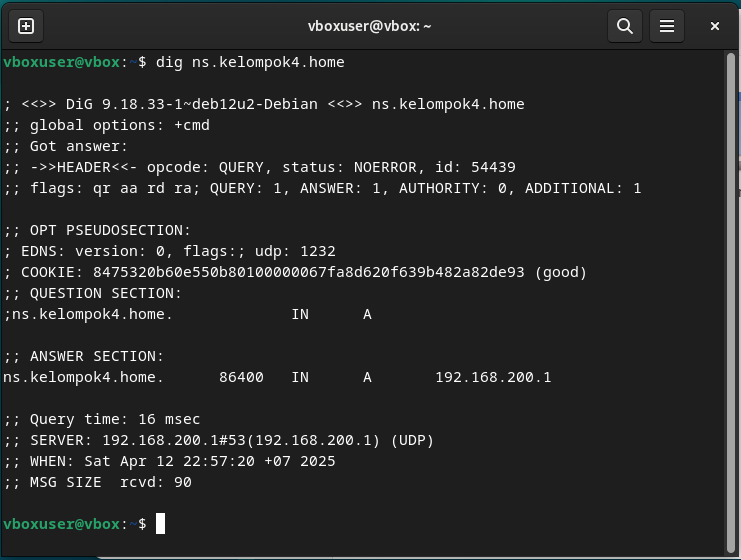

Jika ANSWER sudah bernilai 1, maka sudah benar dan terkoneksi.

**Kedua, lakukan percobaan dig pada zona reverse**

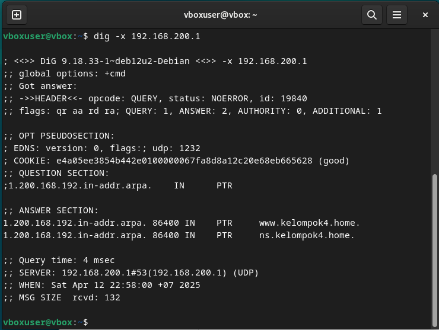

Jika ANSWER sudah bernilai 2, maka sudah benar dan terkoneksi.