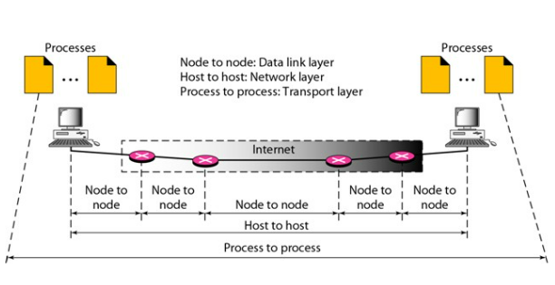

  <h1 class="text-align: center;font-weight: bold">Praktikum  Workshop Administrasi Jaringan</h1>
  <h3 class="text-align: center;">Dosen Pengampu : Dr. Ferry Astika Saputra, S.T., M.Sc.</h3>

 

  
  <h3 style="text-align: center;">Disusun Oleh : </h3>
  

    <strong>Ragil Ridho Saputra (3123500016)</strong> 
  

<h3 style="text-align: center;line-height: 1.5">Politeknik Elektronika Negeri Surabaya Departemen Teknik Informatika Dan Komputer Program Studi Teknik Informatika 2025/2026</h3>
  

# Tugas review Deskripsi : 
## 1.	Analisa file http.cap dengan wireshark : Versi HTTP yang digunakan, IP address dari client maupun server, waktu dari client mengirimkan HTTP request., Waktu dari server mengirimkan server dan berapa durasinya 

•   Versi HTTP: 1.1

•	Ip address client : 145.254.160.237

•	Ip address server: 65.208.228.223

•	Waktu dari client mengirimkan HTTP request : 0,911310

•	Waktu dari server mengirimkan server: 4,846969

•	Berapa durasinya: 4,846969 - 3,95568 = 0,891281
 
## 2.	Deskripsi gambar pada slide 
 

Komputer berkomunikasi melalui berbagai lapisan jaringan, seperti yang ditunjukkan pada gambar di atas.

•	Lapisan Data Link: Bertanggung jawab untuk komunikasi langsung antar perangkat 
yang terhubung secara fisik dalam jaringan yang sama. Lapisan ini juga berperan 
dalam mendeteksi dan memperbaiki kesalahan agar data dapat sampai dengan benar.

•	Lapisan Network: Mengatur komunikasi antar perangkat yang berada di jaringan 
yang berbeda. Lapisan ini menentukan alamat tujuan dan rute terbaik sehingga data 
dapat dikirimkan ke perangkat lain meskipun berada di jaringan yang berbeda. 

•	Lapisan Transport: Menangani komunikasi antar aplikasi di berbagai perangkat. 
Lapisan ini memastikan data dikirim dengan aman dan tanpa gangguan, membagi data 
menjadi bagian-bagian kecil, mengatur kecepatan pengiriman agar tidak menumpuk, 
dan memastikan bahwa semua data sampai dengan urutan yang tepat tanpa ada yang 
hilang. 

 
## 3.	Rangkuman tahapan komunikasi menggunakan TCP

TCP (Transmission Control Protocol) adalah protokol yang memastikan komunikasi 
antara dua perangkat dalam jaringan berlangsung dengan andal, sehingga data dapat 
dikirim secara berurutan dan tanpa kehilangan. Proses komunikasi dalam TCP terdiri dari 
tiga tahapan utama yaitu pembangunan koneksi (Three-Way Handshake), pengiriman 
data (Data Transmission), dan terminasi koneksi (Four-Way Handshake). Berikut adalah 
tahapan komunikasi TCP:

a. Three-Way Handshake (Membangun Koneksi) 

• SYN: Klien memulai komunikasi dengan mengirimkan paket SYN ke server. Paket 
ini berisi nomor urut awal (Sequence Number) yang akan digunakan untuk mengatur 
urutan data selama transmisi. 

• SYN-ACK: Server, setelah menerima paket SYN, merespons dengan paket SYN
ACK. Paket ini berisi nomor urutnya sendiri serta nomor urut dari klien yang telah 
ditingkatkan satu angka, sebagai tanda penerimaan permintaan koneksi. 

• ACK: Klien mengirimkan paket ACK sebagai konfirmasi bahwa koneksi telah 
diterima dan siap digunakan. Setelah tahap ini selesai, koneksi antara klien dan server 
dianggap terbentuk dan siap untuk mentransfer data.

b. Data Transmission (Pengiriman Data) 

• Setelah koneksi terbentuk, data dikirim dalam bentuk segmen TCP. 

• Setiap segmen memiliki nomor urut (sequence number) dan penerima 
mengirimkan ACK untuk mengonfirmasi penerimaan. 

• Jika segmen hilang atau rusak, pengirim akan mengirim ulang data.

c. Four-Way Handshake (Terminasi Koneksi) 

• FIN: Klien mengirimkan paket FIN untuk memberi tahu server bahwa ia ingin 
mengakhiri koneksi. 

• ACK: Server mengakui permintaan ini dengan mengirimkan paket ACK. Namun, 
koneksi masih tetap terbuka sementara karena server mungkin masih memiliki data 
yang harus dikirim ke klien. 

• FIN: Setelah server menyelesaikan pengiriman data terakhirnya, ia juga mengirimkan 
paket FIN ke klien untuk menunjukkan bahwa ia juga ingin menutup koneksi. 

• ACK: Klien merespons dengan paket ACK sebagai tanda bahwa ia telah menerima 
permintaan terminasi dari server. Setelah paket ini dikirim, koneksi dianggap benar
benar tertutup.

Protokol TCP dirancang untuk menjamin keandalan komunikasi dengan mekanisme seperti 
error checking, retransmission, dan flow control untuk memastikan data sampai dengan 
benar dan berurutan.
